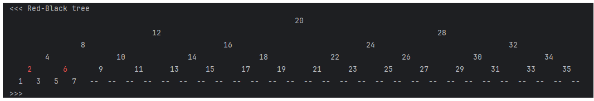
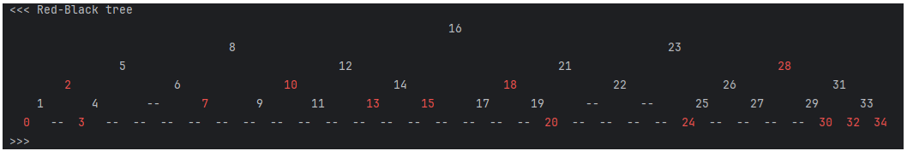

# *redBlackTree*

**redBlackTree** - приложение Java с реализацией Красно-черного дерева на собственных структурах и алгоритмах. 

### Структура приложения

> Пакеты с собственными структурами данных (**базовые**). 
> Все классы **параметризованные <K, V>** (K - тип ключа, V - тип данных). 
> Все коллекции реализуют Comparable ключей и упорядочены в соответствии с их естественным порядком. 
>> - **binarySearchTree** - Двоичное дерево поиска (Binary search tree, BST). 
>> - **utils** - Пакет утилит, констант и унификации вывода данных в консоль или файл. 

> Пакет с собственной структурой данных (на основе **базовых**). 
> Класс RBTree **параметризованный <K, V>** (K - тип ключа, V - тип данных). 
> Коллекция класса реализует Comparable ключей и упорядочена в соответствии с их естественным порядком. 
>> - **redBlackTree** - Красно-черное дерево (red-black tree, RB tree). 
 

### Запуск приложения

- Подробные комментарии работы алгоритма находятся в файле **Main.java** 

> Пример красно-черного дерева с целочисленным ключом: 
RBTree<Integer, String> **tree** = new RBTree<>(); 
**tree**.add(123, "A");
>> - **tree**.out.display(0); - вывод в консоль
>> - **tree**.out.display(0, "file.txt"); - вывод в файл 

- Результат запуска приложения
> O - **Сравнение** формирования деревьев с целыми и строковыми ключами (с данными) 

> I - последовательное **возрастание** целых ключей. 

> II - последовательное **убывание** целых ключей. 

> III - **случайные** целые ключи. 

 
