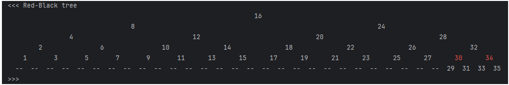
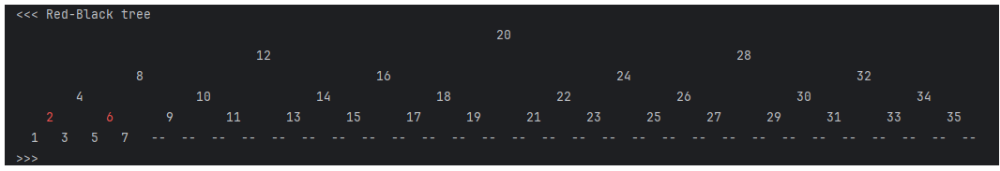
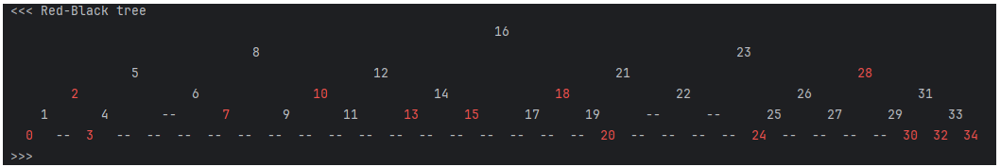

# *redBlackTree*

**redBlackTree** - приложение Java с реализацией Красно-черного дерева на собственных структурах и алгоритмах.

 

### Запуск приложения

- Подробные комментарии работы алгоритма находятся в файле **Main.java**
 

> Tree.txt - файл, в который будет сохранено красно-черное дерево
>> если использовать команду в коде приложения Main.java 
>> tree.displayTree("Tree.txt", StandardCharsets.UTF_8, 0);

> Красно-черное дерево можно вывести в консоль приложения
>> если использовать команду в коде приложения Main.java 
>> tree.displayTree(0);

- Результаты запуска приложения с разными видами генерации ключа

> I - **возрастание** значений ключей
 

> II - **убывание** значений ключей
 

> III - **случайные** значения ключей
 

 
